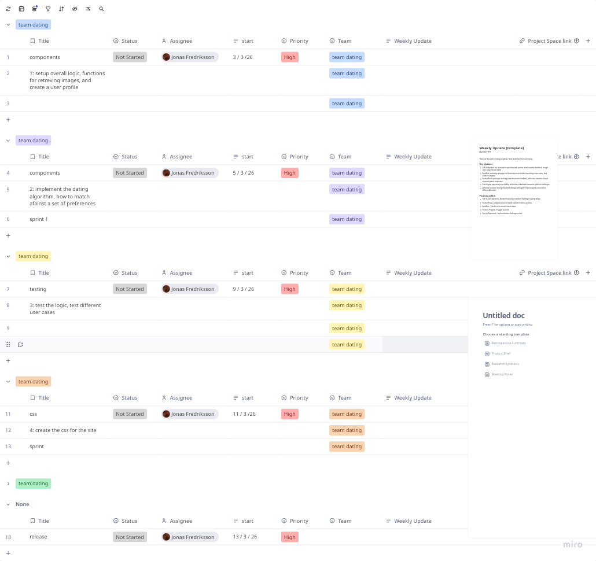

## aperfectmatch

description

This is a dating site in wich customers are matched against available partners

overall planning:

sprint 1:
1: setup overall logic, functions for retreving images, and create a user profile

2: implement the dating algorithm, how to match afainst a set of preferences

sprint 2: 
3: test the logic, test different user cases

4: create the css for the site

details: 

1: the ovall logic is to create components that can read pictures from an 
   api https://api.unsplash.com/search/photos
   and then be able to register a profile that is used to mathc other profiles

2: the dating algorithm should be stable and as an input the preferences of different can   didates and provide a list of candidates. 

3: the matching algoritm should be tested that it is stable, i.e that is always provide a   result

4: the overaill css should be made with tailwind and as an example of the final result is   an example below
   

This is the roadmap for this project

## backlog:

create components: getpicture, upload profile, criteria selector, selecting algorithm

create testing suite: stable algorithm testing

create all css and grid system for all pictures
